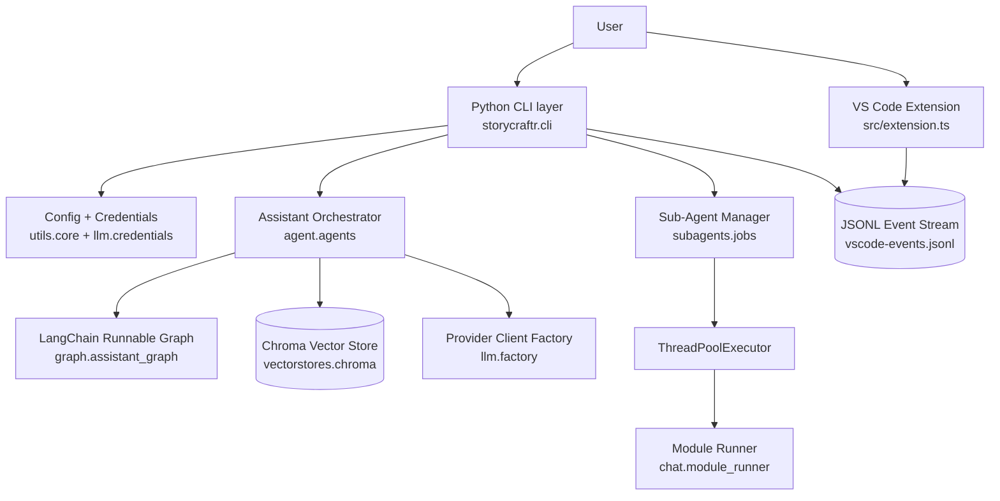

# StoryCraftr-Next Complete Architecture and Technical Reference

## Document Metadata
- Last updated: March 4, 2026
- Codebase root: `/home/orion22/storycraftr-next`
- Python package version in source: `0.10.1-beta4` (`pyproject.toml`)
- Status note: this document includes unreleased hardening work present in the current working tree as of March 2026.

## Executive Summary
StoryCraftr-Next is a local-first writing platform with two CLIs (`storycraftr`, `papercraftr`) and a VS Code extension.

Core architecture:
- Python monolith for command routing, orchestration, generation, and persistence.
- LangChain-based assistant graph for retrieval + prompting.
- Local Chroma vector store for project-specific RAG.
- JSONL IPC stream consumed by the VS Code extension.
- Background sub-agent execution using `ThreadPoolExecutor`.

Recent architecture hardening (current branch):
- Provider-safe LLM factory validation and explicit error classes.
- Secure-first credentials loading (env -> keyring -> legacy plaintext fallback).
- Central runtime path resolution via `resolve_project_paths`.
- Sub-agent cancellation and shutdown race handling improvements.
- Targeted regression tests for factory, paths, sub-agent lifecycle, assistant graph, and CLI smoke behavior.

## High-Level Architecture



## Repository Structure (Operational)
- `storycraftr/cli.py`: top-level CLI commands and bootstrapping.
- `storycraftr/agent/agents.py`: assistant lifecycle, vector sync, message generation.
- `storycraftr/graph/assistant_graph.py`: LangChain runnable graph assembly.
- `storycraftr/llm/factory.py`: provider/client construction and validation.
- `storycraftr/llm/credentials.py`: secure credential loading and keyring helper.
- `storycraftr/vectorstores/chroma.py`: Chroma persistence setup.
- `storycraftr/utils/paths.py`: centralized path resolution.
- `storycraftr/subagents/jobs.py`: background job lifecycle and persistence.
- `storycraftr/integrations/vscode.py`: event emission and extension install helper.
- `src/extension.ts`: VS Code event stream watcher and UI reactions.
- `tests/`: unit and integration test suites.

## Runtime Entry Points

### CLI Entry Points
- `storycraftr = storycraftr.cli:cli`
- `papercraftr = storycraftr.cli:cli`

### Startup Behavior
`load_local_credentials()` is executed at CLI module import in `storycraftr/cli.py`.

Implication:
- Provider credentials are populated before command execution.
- Credential source precedence applies globally for each CLI invocation.

## Core Execution Flows

### 1. Project Initialization (`storycraftr init`)
Primary path:
1. `cli.init` validates flags and behavior file.
2. `init_structure_story` or `init_structure_paper` scaffolds project files.
3. Config JSON (`storycraftr.json` or `papercraftr.json`) is written.
4. Default sub-agent roles are seeded.
5. `create_or_get_assistant()` initializes LLM + embeddings + vector store.

Smoke coverage:
- `tests/integration/test_cli_smoke.py` validates isolated init flow with mocked assistant bootstrap.

### 2. Interactive Chat Turn (`storycraftr chat`)
Primary path:
1. `cmd/chat.py` loads config and optionally creates VS Code emitter.
2. Assistant retrieved from cache or created (`create_or_get_assistant`).
3. `create_message()` pipeline:
   - `_build_message_content`
   - `_build_prompt_with_metadata`
   - `_invoke_assistant_graph`
   - `_record_thread_turn`
   - `_update_progress`
4. Turn is rendered and autosaved in session history.
5. Event emitted to JSONL stream (`chat.turn`) when emitter is active.

### 3. Sub-Agent Job Lifecycle (`:sub-agent ...`)
Primary path:
1. Chat command parser routes to `SubAgentJobManager.submit(...)`.
2. Role and command whitelist are validated.
3. Job is queued and executed via `ThreadPoolExecutor`.
4. Worker calls `run_module_command(...)` (in-process command dispatch; no shell subprocess orchestration).
5. Job output/errors are persisted to role log directories.
6. Completion events are emitted (`sub_agent.queued/running/succeeded/failed`).

Current reliability behavior:
- Uses `threading.RLock` for state updates.
- Tracks job futures in-memory.
- `shutdown(wait=False)` cancels pending futures from a stable snapshot to avoid mutation races.
- Cancelled pending jobs are marked failed and persisted with cancellation diagnostics.

Regression coverage:
- `tests/unit/test_subagent_jobs.py` (deterministic cancellation test with `threading.Event`).
- `tests/unit/test_subagents.py` (execution/failure/persistence behaviors).

## LLM Provider Layer

### Supported Providers
- `openai`
- `openrouter`
- `ollama`
- `fake` (offline placeholder model)

### Validation and Error Model
`storycraftr/llm/factory.py` enforces preflight checks:
- provider normalization (`_normalize_provider`)
- model presence and shape (`_validate_model`)
- endpoint URL validation (`_validate_endpoint`)
- temperature and timeout validation

Provider-specific exceptions:
- `LLMConfigurationError`
- `LLMAuthenticationError`
- `LLMInitializationError`

OpenRouter hardening details:
- `llm_model` must be in `provider/model` format.
- Endpoint resolution order:
  1. `LLMSettings.endpoint` (`llm_endpoint`)
  2. `OPENROUTER_BASE_URL`
  3. default `https://openrouter.ai/api/v1`
- Invalid URL formats fail fast before client construction.

Regression coverage:
- `tests/unit/test_llm_factory.py`.

## Credentials and Secret Resolution
`storycraftr/llm/credentials.py` loading order:
1. Existing environment variables.
2. OS keyring entries under service `storycraftr` (overridable by `STORYCRAFTR_KEYRING_SERVICE`).
3. Legacy plaintext files in `~/.storycraftr` or `~/.papercraftr`.

Additional API:
- `store_local_credential(env_var, api_key, service_name=None)` for writing to keyring.

Security posture:
- Legacy plaintext remains supported for compatibility.
- Legacy usage prints migration warning in CLI output.

Regression coverage:
- `tests/unit/test_credentials.py`.

## Configuration Model
Primary config files:
- `storycraftr.json`
- `papercraftr.json`

Core fields include:
- Project metadata: `book_path`, `book_name`, `primary_language`, etc.
- LLM: `llm_provider`, `llm_model`, `llm_endpoint`, `llm_api_key_env`, `temperature`, `request_timeout`.
- Embeddings: `embed_model`, `embed_device`, `embed_cache_dir`.

Note on model defaults:
- `load_book_config` only auto-defaults OpenAI model (`gpt-4o`) when `llm_model` is missing.
- OpenRouter requires explicit model in config.

## Runtime Path Resolution
Central path resolver:
- `storycraftr/utils/paths.py::resolve_project_paths(book_path, config=None)`

Default logical layout:
- internal state root: `.storycraftr`
- sub-agents root: `.storycraftr/subagents`
- sub-agent logs: `.storycraftr/subagents/logs`
- sessions: `.storycraftr/sessions`
- vector store: `vector_store`
- VS Code event stream: `.storycraftr/vscode-events.jsonl`

Supported override keys in config:
- `internal_state_dir`
- `subagents_dir`
- `subagent_logs_dir`
- `sessions_dir`
- `vector_store_dir`
- `vscode_events_file`

Resolution semantics:
- Relative values resolve from canonical project root.
- Absolute values are used as-is.
- Resolver consumes canonicalized runtime `book_path` from config loader.

Modules migrated to resolver:
- `subagents/storage.py`
- `subagents/jobs.py`
- `chat/session.py`
- `integrations/vscode.py`
- `vectorstores/chroma.py`
- `utils/cleanup.py`
- `agent/agents.py`

Regression coverage:
- `tests/unit/test_core_paths.py`.

## Assistant Graph and Retrieval
Graph builder:
- `storycraftr/graph/assistant_graph.py::build_assistant_graph`

Graph behavior:
- Requires initialized retriever.
- Accepts string or dict payload.
- Retrieves documents if none supplied.
- Formats context with source labels.
- Runs prompt -> LLM -> output parser.
- Returns parallel result payload: `answer` + `documents`.

RAG build behavior (`agent/agents.py`):
- Loads markdown files recursively.
- Excludes files under configured vector store path.
- Skips files with fewer than 4 lines.
- Splits with `RecursiveCharacterTextSplitter` (`chunk_size=1000`, `chunk_overlap=150`).
- Retriever defaults to `k=6`.

Regression coverage:
- `tests/unit/test_assistant_graph.py`.
- `tests/unit/test_agents_create_message.py`.

## Persistence and State

### Persistent Artifacts
- Project content: markdown in project directories (`chapters/`, `outline/`, etc.).
- Vector DB: configured vector store directory.
- Session transcripts: configured sessions directory, JSON format.
- Sub-agent logs:
  - metadata JSON always
  - markdown output when output/error exists
- VS Code event stream: JSONL append-only file.

### In-Memory Caches
- Assistant cache: `_ASSISTANT_CACHE`
- Thread cache: `_THREADS`
- Sub-agent job/future maps per manager instance.

## VS Code Integration Contract

### Event Envelope
Python emitter writes lines as:
```json
{"event": "chat.turn", "payload": {"user": "...", "answer": "..."}}
```

Primary event names:
- `session.started`, `session.ended`
- `chat.command`, `chat.turn`
- `sub_agent.queued`, `sub_agent.running`, `sub_agent.succeeded`, `sub_agent.failed`
- `sub_agent.logs`, `sub_agent.status`

### Important Compatibility Note
Current extension discovery in `src/extension.ts` watches only:
- `**/.storycraftr/vscode-events.jsonl`

Implication:
- If project config overrides `vscode_events_file` to a non-default path, CLI emission still works but the extension may not auto-discover that stream.

## Testing Status (Current Workspace)
Latest local run:
- Command: `poetry run pytest`
- Result: `53 passed, 1 skipped`
- Existing warnings:
  - unknown pytest config option `line-length`
  - unknown pytest config option `target-version`

Active suites include:
- `tests/unit/test_llm_factory.py`
- `tests/unit/test_credentials.py`
- `tests/unit/test_llm_config.py`
- `tests/unit/test_assistant_graph.py`
- `tests/unit/test_agents_create_message.py`
- `tests/unit/test_subagent_jobs.py`
- `tests/unit/test_core_paths.py`
- `tests/unit/test_subagents.py`
- `tests/unit/test_vscode_integration.py`
- `tests/integration/test_cli_smoke.py`
- plus legacy/utility tests in `tests/` root.

## Known Gaps and Technical Debt

High-impact gaps:
1. Extension path discovery mismatch with configurable `vscode_events_file`.
2. No automatic file-watcher driven vector refresh; updates rely on explicit rebuild flows.
3. Observability remains console/event-file centric; no structured logging backend.
4. Config schema migrations are implicit; no versioned migrator.

Moderate gaps:
1. Some graph and retrieval quality guarantees are test-covered functionally but not benchmarked for large corpora.
2. `agent/agents.py` contains broad responsibilities and remains a large orchestration module.

## Change Highlights Included in This Revision
This document now reflects:
- OpenRouter model validation hardening and provider-specific failures.
- Secure-first credential loader and keyring helper behavior.
- Centralized dynamic runtime path resolution.
- Refactored `create_message` orchestration boundaries.
- Sub-agent shutdown and cancellation handling fixes.
- Added regression suites for:
  - OpenRouter factory behavior
  - deterministic sub-agent shutdown
  - path invariants
  - CLI init smoke
  - assistant graph behavior

## Operator Quick Commands
```bash
# Full Python tests
poetry run pytest

# Focused regressions
poetry run pytest tests/unit/test_llm_factory.py
poetry run pytest tests/unit/test_subagent_jobs.py
poetry run pytest tests/unit/test_core_paths.py
poetry run pytest tests/integration/test_cli_smoke.py

# CLI sanity
poetry run storycraftr --help
```

## Appendix: Key Files to Review First
- `storycraftr/cli.py`
- `storycraftr/agent/agents.py`
- `storycraftr/graph/assistant_graph.py`
- `storycraftr/llm/factory.py`
- `storycraftr/llm/credentials.py`
- `storycraftr/utils/paths.py`
- `storycraftr/subagents/jobs.py`
- `storycraftr/integrations/vscode.py`
- `src/extension.ts`
- `tests/unit/test_llm_factory.py`
- `tests/unit/test_subagent_jobs.py`
- `tests/unit/test_core_paths.py`
- `tests/integration/test_cli_smoke.py`
